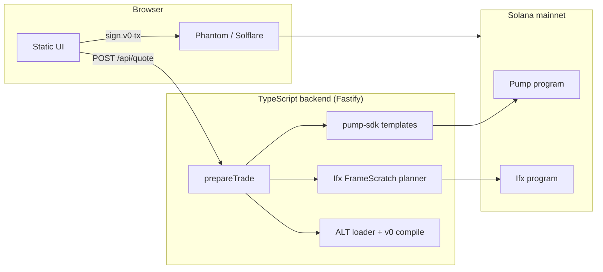

# ifx-pumpfun-ext

[](./LICENSE)
[](./package.json)

English | [中文](./README.zh-CN.md)

**Pump.fun bonding-curve trading, orchestrated by [Ifx](https://github.com/ifx-run/ifx) — in a single transaction.**

A self-hosted showcase: Fastify API + static browser UI. Paste a mint, get an exact-input quote, inspect the assembled v0 transaction instruction-by-instruction, and sign with Phantom or Solflare.

> **Demo software.** Mainnet-ready plumbing for operators and integrators — not a audited production exchange. Use at your own risk.

---

## Highlights

| | |
|---|---|
| **Exact-input only** | User fixes the input side; output is estimated off-chain and protected by on-chain slippage floors. Uses `buy_exact_quote_in_v2` / `sell_v2` — never `buy_v2` (exact-output). |
| **One-shot quote + build** | `POST /api/quote` fetches blockhash, quotes the route, and returns an unsigned v0 tx when a wallet pubkey is present. |
| **Same-quote two-hop swap** | Token A → quote → Token B; hop-2 `spendable_quote_in` patched from hop-1 proceeds via Ifx `rawCpiPatch`. |
| **Conditional ATA close** | After sell paths, close the input ATA only when balance hits zero — otherwise Skip (no whole-tx revert). |
| **Quote-only service fee** | Configurable bps fee in SOL or USDC, taken at the correct hop boundary — never in meme tokens. |
| **SOL sponsor + repay** | Optional gas/rent for SOL-quote **sells** (user toggle; repay from proceeds). Not available for buys or two-hop swaps. |
| **v0 + ALT** | Every build compiles a versioned transaction with configured Address Lookup Tables; smart-close instructions are dropped when size would exceed the limit. |
| **Transaction inspector** | Per-instruction account list with ALT vs static resolution, hex data, and post-send on-chain Success / Failed status. |

---

## Screenshots

The UI splits **trade form** (left) from **trade preview + transaction inspector** (right):

```text
┌──────────────────────────────┬─────────────────────────────────────┐
│  Wallet · SOL / USDC chips   │  Trade preview · Sign & Send        │
│  Mode · Mint A/B · Amount    │  Pay → Receive · platform fee       │
│  Slippage · Priority         │  ─────────────────────────────────  │
│  Refresh quote               │  Transaction inspector              │
│                              │  ix #0 Pump · ix #1 Ifx · …        │
│                              │  Result: Success · Solscan link     │
└──────────────────────────────┴─────────────────────────────────────┘
```

After **Sign & Send**, the right panel stays frozen until the user cancels in-wallet or enters a new amount — quotes and countdowns will not overwrite the preview.

---

## Why Ifx fits Pump.fun

| Requirement | Ifx capability | Canonical example |
|-------------|----------------|-------------------|
| Close ATA only when balance is 0 after sell | `ifx_let` + `ifx_if_else` → CloseAccount or Skip | [dust-destroy-token2022](https://github.com/ifx-run/ifx/blob/main/sdk/examples/dust-destroy-token2022.ts) |
| A → quote → B hop-2 amount from hop-1 output | Static hop-1 → `let` intermediate quote → `rawCpiPatch` hop-2 | [two-hop-token-swap](https://github.com/ifx-run/ifx/blob/main/sdk/examples/two-hop-token-swap.ts) |
| Sponsor rent/fee when user SOL is low; repay on sell | Baseline `let` → idempotent ATA → patched `SystemProgram.transfer` | [sponsored_buy](https://github.com/ifx-run/ifx/blob/main/tests/sponsored_buy.ts) |
| Patch Pump `sell_v2` / `buy_exact_quote_in_v2` fields | `rawCpi` + documented `data_offset` | [raw-cpi-patches](https://github.com/ifx-run/ifx/blob/main/docs/raw-cpi-patches.md) |

Off-chain templates and curve math: [`@pump-fun/pump-sdk`](https://www.npmjs.com/package/@pump-fun/pump-sdk). On-chain orchestration: [`@ifx-run/sdk`](https://www.npmjs.com/package/@ifx-run/sdk) ([source](https://github.com/ifx-run/ifx/tree/main/sdk)).

---

## Example transactions (mainnet)

Transactions assembled by this stack on Solana mainnet:

| Flow | Solscan |
|------|---------|
| **Two-hop swap** — sell token A, Ifx `let` + patched `buy_exact_quote_in_v2` for token B in one tx | [2Q41RL3bW5BaNMW19RqGRNnoz3t4vuApVKVxPSN38rjLAG3dVaQDAtsjvLHPsLuapFjxxT2dzFovpFePHhesdegT](https://solscan.io/tx/2Q41RL3bW5BaNMW19RqGRNnoz3t4vuApVKVxPSN38rjLAG3dVaQDAtsjvLHPsLuapFjxxT2dzFovpFePHhesdegT) |
| **Sponsored sell** — sponsor co-signs as fee payer; patched SOL repay from sell proceeds | [4VEQXHs176NLA5pbjL16hT7Ly4WWWC83P1VQGYXT416tJAS5APirSQbDaeXftSqKnotoCfkWtZBYYoYu64QgNAe9](https://solscan.io/tx/4VEQXHs176NLA5pbjL16hT7Ly4WWWC83P1VQGYXT416tJAS5APirSQbDaeXftSqKnotoCfkWtZBYYoYu64QgNAe9) |

---

## Architecture



```text
Browser (debounced quote, wallet sign)
    │
    ▼
Fastify API
    ├── @pump-fun/pump-sdk   → buy_exact_quote_in_v2 / sell_v2 templates + curve math
    ├── @ifx-run/sdk         → FrameScratch, rawCpiPatch, if_else, service fee CPIs
    └── @solana/web3.js      → batched getMultipleAccounts, v0 + ALT compile
    │
    ▼
Solana mainnet — Pump bonding curve + Ifx program
```

**Scope (v1):** bonding curve only — graduated curves (`complete == true`) are rejected. No PumpSwap AMM, Token-2022 fee harvest, or Jito bundles.

---

## Quick start

### Prerequisites

- **Node.js ≥ 20**
- A Solana **mainnet RPC** URL (public endpoints work for demos; use a dedicated RPC for production traffic)

### Run locally

```bash
git clone https://github.com/ifx-run/ifx-pumpfun-ext.git
cd ifx-pumpfun-ext
npm install
cp config.example.toml config.toml
# Edit config.toml — at minimum set serviceFee.pubkey (receive-only fee recipient)

npm run dev
# → http://127.0.0.1:8787
```

Production build:

```bash
npm run build
npm start
```

### Minimal config

```toml
[server]
host = "127.0.0.1"
port = 8787

[solana]
rpc_url = "https://api.mainnet-beta.solana.com"

[service_fee]
bps = 5
pubkey = "YourFeeRecipientPubkey..."

[ifx]
program_id = "ifxmwWVVZDmXN2DUVf7wtJYCXTRY4QsL5rzmNkXzxbj"
public_frames = ["6RNv1eQ7fogEW7R1QGg6dAiddEefGfYgJVtjpvgENtdn"]

[sponsor]
enabled = false
# pubkey + keypair_path when enabled — see docs/config.md
```

Copy [`config.example.toml`](./config.example.toml) for the full schema. JSON is also supported (`config.example.json`); if both exist, **TOML wins**.

Full reference: [`docs/config.md`](./docs/config.md) · [`docs/config.zh-CN.md`](./docs/config.zh-CN.md)

---

## Optional: Address Lookup Tables

Large buy + Ifx close paths may exceed the legacy 1232-byte limit. Configure one or more on-chain ALTs:

```toml
[solana]
address_lookup_tables = ["YourAltPubkey..."]
```

Extend with the bundled script (see address tiers in [`docs/alt-addresses.zh-CN.md`](./docs/alt-addresses.zh-CN.md)):

```bash
npm run alt:extend -- --alt YourAltPubkey... --keypair ./keys/alt-authority.json
```

Every `/api/quote` build compiles **v0** with these tables. The inspector labels each account as **ALT** (loaded via lookup table) or **static**.

---

## API

| Method | Path | Description |
|--------|------|-------------|
| `GET` | `/api/health` | Liveness probe |
| `GET` | `/api/config/public` | Debounce, slippage defaults, fee bps, RPC URL, frame count |
| `POST` | `/api/token/resolve` | Mint metadata, quote pool (SOL/USDC), swap eligibility |
| `POST` | `/api/wallet/balances` | User SOL + USDC balances |
| `POST` | `/api/quote` | Quote + blockhash + unsigned v0 tx (`prepareTrade`) |
| `POST` | `/api/tx/build` | Build-only (same body as quote; used when re-building with a snapshot) |

Example quote body:

```json
{
  "mode": "trade",
  "side": "buy",
  "mintA": "<base58 mint>",
  "inputAmount": "0.05",
  "slippageBps": 100,
  "userPubkey": "<wallet>",
  "priorityTier": "medium"
}
```

Response includes `inputRaw`, `expectedOutputUi`, `serviceFeeRaw`, `netQuoteRaw`, `route`, optional `build` (base64 tx + inspection), and `blockhash` with expiry hint.

Details: [`docs/design.md`](./docs/design.md) §3

---

## Scripts

| Command | Description |
|---------|-------------|
| `npm run dev` | Dev server with hot reload (`tsx watch`) |
| `npm run build` | Compile TypeScript to `dist/` |
| `npm start` | Run compiled server |
| `npm run typecheck` | Type-check without emit |
| `npm run alt:extend` | Extend a configured ALT with recommended addresses |

---

## Project layout

```text
src/
  server.ts           Fastify routes
  ifx/build.ts        prepareTrade · v0 compile · smart close
  ifx/planner/        buy · sell · swap · service fee · sponsor · close ATA
  pump/               resolve · quote · Pump ix templates
  solana/             connection · ALT cache · blockhash helper
  wallet/             SOL/USDC balance fetch
public/               Static showcase UI
scripts/              ALT extend tooling
docs/                 Design · config · implementation · ALT address tiers
```

---

## Documentation

| Document | Description |
|----------|-------------|
| [`docs/design.md`](./docs/design.md) | UX, API, exact-input rules, Ifx tx topology |
| [`docs/design.zh-CN.md`](./docs/design.zh-CN.md) | 中文版设计文档 |
| [`docs/implementation.md`](./docs/implementation.md) | Modules, RPC batching, rollout notes |
| [`docs/config.md`](./docs/config.md) | Configuration and environment overrides |
| [`docs/alt-addresses.zh-CN.md`](./docs/alt-addresses.zh-CN.md) | Recommended ALT address tiers |

---

## Related

- [ifx-run/ifx](https://github.com/ifx-run/ifx) — Ifx on-chain program and TypeScript SDK
- [Pump.fun](https://pump.fun) — bonding curve launchpad (this demo targets **V2** curve instructions only)

---

## License

[MIT](./LICENSE) © ifx-run contributors
