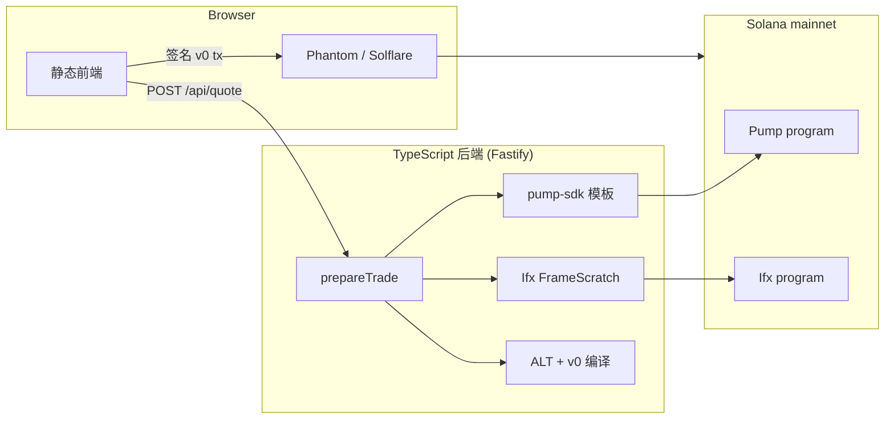

# ifx-pumpfun-ext

[](./LICENSE)
[](./package.json)

[English](./README.md) | 中文

**在单笔 Solana 交易里，用 [Ifx](https://github.com/ifx-run/ifx) 编排 Pump.fun bonding curve 买卖与互换。**

自托管展示项目：Fastify 后端 + 静态前端。粘贴 mint、获取精确输入报价、逐条检视组装好的 v0 交易指令，并用 Phantom / Solflare 签名发送。

> **演示用途。** 面向运营者与集成方的 mainnet 级管线，非经审计的生产交易所。使用风险自负。

---

## 核心能力

| | |
|---|---|
| **精确输入（exact-input）** | 用户固定输入侧；输出链下估算，链上由滑点下限保护。使用 `buy_exact_quote_in_v2` / `sell_v2`，**不用** `buy_v2`（精确输出）。 |
| **Quote + Build 一次完成** | `POST /api/quote` 并行拉 blockhash、报价，并在传入钱包时返回未签名 v0 交易。 |
| **同 quote 两跳互换** | Token A → quote → Token B；第二跳 `spendable_quote_in` 由 Ifx `rawCpiPatch` 从第一跳 proceeds 注入。 |
| **条件关 ATA** | 卖出路径结束后，仅当输入 token ATA 余额为 0 时 `closeAccount`，否则 Skip，避免整笔交易 revert。 |
| **Quote 平台手续费** | 可配置 bps，仅在 SOL / USDC 上收取，在正确的 hop 边界扣款——从不扣 meme token。 |
| **SOL 代付 + 偿还** | SOL quote 买入时可代付 gas/rent；卖出（含 swap 卖腿）通过 patched transfer 偿还 sponsor。 |
| **v0 + ALT** | 每次 build 编译版本化交易并加载配置的 Address Lookup Table；体积超限时自动跳过 smart-close 指令。 |
| **Transaction inspector** | 逐指令账户表（ALT / static 解析）、hex 数据、发送后链上 **Success / Failed** 状态。 |

---

## 界面概览

左侧为交易表单，右侧为 **Trade preview** 与 **Transaction inspector**：

```text
┌──────────────────────────────┬─────────────────────────────────────┐
│  钱包 · SOL / USDC 余额      │  Trade preview · Sign & Send        │
│  模式 · Mint A/B · 数量      │  Pay → Receive · 平台费             │
│  滑点 · Priority             │  ─────────────────────────────────  │
│  Refresh quote               │  Transaction inspector              │
│                              │  ix #0 Pump · ix #1 Ifx · …        │
│                              │  Result: Success · Solscan 链接     │
└──────────────────────────────┴─────────────────────────────────────┘
```

点击 **Sign & Send** 后，右侧面板会锁定，直到用户在钱包中取消签名或输入新的交易数量——后台 quote 与 blockhash 倒计时不会覆盖预览。

---

## 为什么 Ifx 适合 Pump.fun

| 需求 | Ifx 能力 | 参考示例 |
|------|----------|----------|
| 卖出后余额为 0 才关 ATA | `ifx_let` + `ifx_if_else` → CloseAccount 或 Skip | [dust-destroy-token2022](https://github.com/ifx-run/ifx/blob/main/sdk/examples/dust-destroy-token2022.ts) |
| A→quote→B 第二跳 amount 来自第一跳 | hop1 静态 CPI → `let` 中间 quote → `rawCpiPatch` hop2 | [two-hop-token-swap](https://github.com/ifx-run/ifx/blob/main/sdk/examples/two-hop-token-swap.ts) |
| SOL 不足时代付 rent/fee，卖出后偿还 | 基线 `let` → 幂等 ATA → patched transfer | [sponsored_buy](https://github.com/ifx-run/ifx/blob/main/tests/sponsored_buy.ts) |
| Patch Pump `sell_v2` / `buy_exact_quote_in_v2` | `rawCpi` + `data_offset` | [raw-cpi-patches](https://github.com/ifx-run/ifx/blob/main/docs/raw-cpi-patches.zh-CN.md) |

链下模板与曲线数学：[`@pump-fun/pump-sdk`](https://www.npmjs.com/package/@pump-fun/pump-sdk)。链上编排：[`@ifx-run/sdk`](https://www.npmjs.com/package/@ifx-run/sdk)（[源码](https://github.com/ifx-run/ifx/tree/main/sdk)）。

---

## 架构



**v1 范围：** 仅 bonding curve；已毕业曲线（`complete == true`）会拒绝。不含 PumpSwap AMM、Token-2022 fee harvest、Jito bundle。

---

## 快速开始

### 环境要求

- **Node.js ≥ 20**
- Solana **mainnet RPC**（演示可用公共节点；生产流量建议专用 RPC）

### 本地运行

```bash
git clone https://github.com/ifx-run/ifx-pumpfun-ext.git
cd ifx-pumpfun-ext
npm install
cp config.example.toml config.toml
# 编辑 config.toml — 至少设置 serviceFee.pubkey（仅收款的 fee 地址）

npm run dev
# → http://127.0.0.1:8787
```

生产构建：

```bash
npm run build
npm start
```

### 最小配置

```toml
[server]
host = "127.0.0.1"
port = 8787

[solana]
rpc_url = "https://api.mainnet-beta.solana.com"

[service_fee]
bps = 5
pubkey = "YourFeeRecipientPubkey..."

[ifx]
program_id = "ifxmwWVVZDmXN2DUVf7wtJYCXTRY4QsL5rzmNkXzxbj"
public_frames = ["6RNv1eQ7fogEW7R1QGg6dAiddEefGfYgJVtjpvgENtdn"]

[sponsor]
enabled = false
# 启用时需 pubkey + keypair_path — 见 docs/config.zh-CN.md
```

完整字段见 [`config.example.toml`](./config.example.toml)。也支持 JSON（[`config.example.json`](./config.example.json)）；两者同时存在时 **优先 TOML**。

配置说明：[`docs/config.zh-CN.md`](./docs/config.zh-CN.md)

---

## 可选：Address Lookup Table (ALT)

Buy + Ifx close 等大交易可能超过 legacy 1232 字节上限。配置链上 ALT：

```toml
[solana]
address_lookup_tables = ["YourAltPubkey..."]
```

使用脚本 extend（地址分层见 [`docs/alt-addresses.zh-CN.md`](./docs/alt-addresses.zh-CN.md)）：

```bash
npm run alt:extend -- --alt YourAltPubkey... --keypair ./keys/alt-authority.json
```

每次 quote build 均编译 **v0** 交易；Inspector 会标注账户为 **ALT**（lookup 加载）或 **static**。

---

## API

| 方法 | 路径 | 说明 |
|------|------|------|
| `GET` | `/api/health` | 健康检查 |
| `GET` | `/api/config/public` | 防抖、默认滑点、fee bps、RPC、Frame 数量 |
| `POST` | `/api/token/resolve` | Mint 元数据、quote 池（SOL/USDC）、swap 是否可用 |
| `POST` | `/api/wallet/balances` | 用户 SOL + USDC 余额 |
| `POST` | `/api/quote` | 报价 + blockhash + 未签名 v0 tx（`prepareTrade`） |
| `POST` | `/api/tx/build` | 仅 build（与 quote 同 body；用于带 snapshot 重建） |

Quote 请求示例：

```json
{
  "mode": "trade",
  "side": "buy",
  "mintA": "<base58 mint>",
  "inputAmount": "0.05",
  "slippageBps": 100,
  "userPubkey": "<wallet>",
  "priorityTier": "medium"
}
```

响应含 `inputRaw`、`expectedOutputUi`、`serviceFeeRaw`、`netQuoteRaw`、`route`，以及可选的 `build`（base64 tx + inspection）和带过期提示的 `blockhash`。

详见 [`docs/design.zh-CN.md`](./docs/design.zh-CN.md) §3

---

## 脚本

| 命令 | 说明 |
|------|------|
| `npm run dev` | 开发服务器（`tsx watch` 热重载） |
| `npm run build` | 编译 TypeScript 到 `dist/` |
| `npm start` | 运行编译后的服务 |
| `npm run typecheck` | 仅类型检查 |
| `npm run alt:extend` | 向 ALT extend 推荐地址 |

---

## 目录结构

```text
src/
  server.ts           Fastify 路由
  ifx/build.ts        prepareTrade · v0 编译 · smart close
  ifx/planner/        buy · sell · swap · 平台费 · sponsor · 关 ATA
  pump/               resolve · quote · Pump 指令模板
  solana/             connection · ALT 缓存 · blockhash
  wallet/             SOL/USDC 余额
public/               静态展示 UI
scripts/              ALT extend 工具
docs/                 设计 · 配置 · 实现 · ALT 地址清单
```

---

## 文档

| 文档 | 说明 |
|------|------|
| [`docs/design.zh-CN.md`](./docs/design.zh-CN.md) | 交互、API、精确输入、Ifx 拓扑 |
| [`docs/design.md`](./docs/design.md) | English design doc |
| [`docs/implementation.zh-CN.md`](./docs/implementation.zh-CN.md) | 模块、RPC 批取 |
| [`docs/config.zh-CN.md`](./docs/config.zh-CN.md) | 配置与环境变量 |
| [`docs/alt-addresses.zh-CN.md`](./docs/alt-addresses.zh-CN.md) | 推荐 ALT 地址分层 |

---

## 相关项目

- [ifx-run/ifx](https://github.com/ifx-run/ifx) — Ifx 链上程序与 TypeScript SDK
- [Pump.fun](https://pump.fun) — bonding curve 发射台（本 demo 仅 **V2** 曲线指令）

---

## 许可证

[MIT](./LICENSE) © ifx-run contributors
