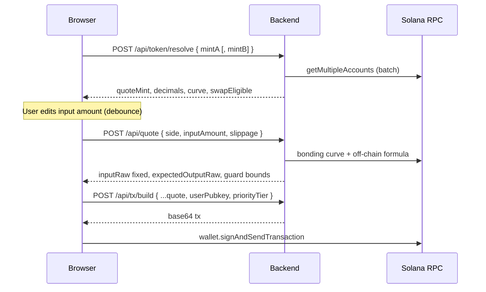

[中文](./design.zh-CN.md) | English

# Design — ifx-pumpfun-ext

## 1. Goals

A locally deployable **backend + lightweight static frontend** showcase for [Ifx](https://github.com/ifx-run/ifx) on Pump.fun:

1. **Buy/sell any Pump token** — paste mint, auto-detect quote (SOL / USDC), quote and trade with **exact input** (output floats).
2. **Same-quote two-hop swap** — Token A → quote → Token B; hop2 `spendable_quote_in` patched from hop1 output (`rawCpi`).
3. **Conditional ATA close** — after sell paths, if input-token ATA balance is 0, `closeAccount`; otherwise Skip (no whole-tx revert).
4. **SOL-quote sponsor + repayment** (USDC quote excluded) — sponsor pays gas/rent when user SOL is low; on sell (including swap sell leg), patch SOL transfer to repay sponsor (+ configurable buffer %).

**Out of scope (v1):** PumpSwap AMM (bonding curve only), Token-2022 fee harvest, Jito bundle splits, exact-output trades.

---

## 2. UX

**Principle:** Once the user picks a pair and enters a fixed input amount, the client quotes immediately (debounced). **Sign & send** reuses that input — no second pricing step.

### 2.1 Single-page layout

```text
┌─────────────────────────────────────────────────────────┐
│  Pump × Ifx Showcase                    [Priority: Med▼] │
├─────────────────────────────────────────────────────────┤
│  Mode: (● Trade) (○ Swap)                                 │
├─────────────────────────────────────────────────────────┤
│  Token A  [ mint input                         ] [Resolve]│
│           → Quote: SOL | curve 42% | 6 decimals           │
│                                                         │
│  [Swap] Token B  [ mint input                  ]         │
│           → Quote: SOL ✓ matches A                        │
├─────────────────────────────────────────────────────────┤
│  Side: [ Buy ▼ ]   (Swap: fixed A → B)                    │
│  You pay / sell  [ ____________ ]  ← fixed input (quote if buy, base if sell/swap)
│  You receive (est.)  1,234,567 TOKEN   ← floating output  │
│  Service fee (est.)  0.000025 SOL     ← quote-only, bps    │
│  Slippage  [ 1% ▼ ]                                       │
├─────────────────────────────────────────────────────────┤
│  Route       sell A → buy B (2 hops + Ifx close)          │
│  Sponsor     ~0.012 SOL advance (repaid on sell)          │
├─────────────────────────────────────────────────────────┤
│  [ Connect wallet ]           [ Build & sign ]            │
└─────────────────────────────────────────────────────────┘
```

### 2.2 Sequence



### 2.3 Exact-input model (required)

**Every route fixes the input side in the built transaction. The output side is estimated off-chain and floats** until the tx lands. Slippage sets a **minimum on the floating output** (`min_base_amount_out` / `min_sol_output`).

**No exact-output.** In particular **`buy_v2` is not used** — its `amount` field fixes base tokens to receive (exact-output). Buys use **`buy_exact_quote_in_v2` only**.

| Route | Fixed input (UI / tx) | Floating output (quote UI) | Pump instruction |
|-------|----------------------|----------------------------|------------------|
| **Buy** | Quote spend (SOL / USDC) | Base received | `buy_exact_quote_in_v2` — `spendable_quote_in` exact; `min_base_amount_out` = est. base × (1 − slippage) |
| **Sell** | Base token amount | Quote received | `sell_v2` — `amount` exact; `min_sol_output` = est. quote × (1 − slippage) |
| **Swap A→B** | Base A amount | Base B received | `sell_v2(A)` + patched `buy_exact_quote_in_v2(B)` — hop2 `spendable_quote_in` from hop1 quote delta |

**UI copy**

- **Buy:** editable **“You pay”** (SOL / USDC); read-only **“You receive (estimated)”** (base tokens).
- **Sell / swap:** editable **“You sell”** (base); read-only estimated quote or token B.
- Slippage → **min out** on the floating side only.

**Quote detection:** read `bonding_curve.quote_mint`. `Pubkey::default()` or wrapped SOL → **SOL**; config USDC mint → **USDC**.

### 2.4 Service fee (platform)

The operator (same **centralized account** as sponsor) charges a configurable **quote-only** fee — **never** in pump base/meme tokens.

| Setting | Default | Meaning |
|---------|---------|---------|
| `serviceFee.bps` | `5` | **万分之五** (5 / 10 000 = 0.05%) of the relevant **quote** amount |

**Settlement**

| Quote pair | Where fee lands |
|------------|-----------------|
| **SOL** | Native lamports to operator wallet |
| **USDC** | SPL transfer to operator **USDC ATA** (must exist **before** service start — one-time off-chain setup) |

**Placement rule** — fee is always taken in **SOL or USDC**, never after the tx would hold only pump tokens:

| Route | When fee is taken | Basis | Never |
|-------|-------------------|-------|-------|
| **Buy** | **Before hop 1** (`buy_exact_quote_in_v2`) | `fee = inputQuote × bps / 10 000`; Pump buy spends `inputQuote − fee` | After buy (output is base) |
| **Sell** | **After hop 1** (`sell_v2`) | `fee = quoteProceeds × bps / 10 000` from sell output | Before sell (only base in wallet) |
| **Swap A→B** | **After hop 1, before hop 2** | `fee = quoteDelta × bps / 10 000`; hop2 `spendable_quote_in = quoteDelta − fee` | After hop 2 (output is token B) |

```text
Buy:     [fee → operator] → buy_exact_quote_in_v2(net quote)
Sell:    sell_v2 → [fee → operator] → …
Swap:    sell_v2(A) → [fee → operator] → buy_exact_quote_in_v2(B) with patched net quote
```

**Quote / UI:** show `serviceFeeRaw`, `serviceFeeLabel` (SOL/USDC), and net quote reaching Pump (`netQuoteRaw`). User **exact input** unchanged — on buy, fee is deducted **from** the stated quote budget before the Pump ix.

**Ifx:** fee transfers use `structuredCpiPatch.systemTransfer` (SOL) or `structuredCpiPatch.tokenTransfer` (USDC → operator USDC ATA). Swap hop2 patch uses `quoteDelta − fee` from Frame `let` + `expr.sub`.

### 2.5 Debounce

- Input amount, slippage, priority tier: **300ms debounce** (`quote.debounceMs`).
- After debounce → immediate `POST /api/quote`; abort stale requests.
- **Build & sign** does not re-quote; expired blockhash → `409`, client retries build with same `inputRaw`.

---

## 3. API

### 3.1 `POST /api/token/resolve`

```json
{ "mintA": "...", "mintB": "..." }
```

`mintB` optional (swap mode).

### 3.2 `POST /api/quote`

```json
{
  "mode": "trade",
  "side": "buy",
  "mintA": "...",
  "mintB": "...",
  "inputAmount": "0.05",
  "slippageBps": 100,
  "userPubkey": "..."
}
```

| Field | Values | Notes |
|-------|--------|-------|
| `mode` | `trade` \| `swap` | |
| `side` | `buy` \| `sell` | Ignored when `mode=swap` (always sell A) |
| `inputAmount` | decimal string | **Exact input** — quote units if `side=buy`, base units if `side=sell` or `mode=swap` |

Response:

```json
{
  "inputRaw": "50000000",
  "inputLabel": "SOL",
  "expectedOutputRaw": "123450000",
  "expectedOutputUi": "123.45",
  "minOutputRaw": "122215500",
  "serviceFeeRaw": "25000",
  "serviceFeeLabel": "SOL",
  "netQuoteRaw": "49750000",
  "route": ["service_fee", "pump.buy_exact_quote_in_v2"],
  "sponsor": { "required": true, "estimatedLamports": 12000000 }
}
```

`minOutputRaw` — on-chain floor for the floating output (`min_base_amount_out` or `min_sol_output`).

### 3.3 `POST /api/tx/build`

Same body as quote plus `userPubkey`, `priorityTier`. Returns `transaction` (base64), `recentBlockhash`, `signers`.

Optional field on build response: `frameUsed` (pubkey picked from `publicFrames` for this tx — debug/support only; not in public config).

### 3.4 `GET /api/config/public`

Non-secret config: priority tiers, default slippage, debounce, sponsor enabled flag, **`publicFrameCount`** (not addresses).

---

## 4. Ifx transaction topology

Every business tx starts with `scratch.ixReset()` on a **public Frame** chosen for that build (see §4.0).

### 4.0 Public Frames (use only — no create, no fetch)

This project **does not create Frames** and **does not fetch or decode Frame accounts**. It uses **existing public Frame pubkeys** from config; planner uses Ifx **`DEFAULT_TAPE_LEN`** (512) — the standard size for public Frames.

```json
"ifx": {
  "programId": "ifxmwWVVZ...",
  "publicFrames": [
    "6RNv1eQ7fogEW7R1QGg6dAiddEefGfYgJVtjpvgENtdn"
  ]
}
```

**Per build:** pick one pubkey uniformly at random from `publicFrames` (single entry → always that Frame), `FrameScratch.forPublicFrame({ framePubkey, programId })`, prepend `ixReset()`.

**Not used:** `decodeFrameAccount`, startup Frame RPC batch, tape-length config, Frame cache files.

**Optional scale-out:** append more **existing** public Frame pubkeys to the list — still no decode; still `DEFAULT_TAPE_LEN` for planner.

**Discipline:** every business tx starts with `ixReset()` ([frame-authority §3.4](https://github.com/ifx-run/ifx/blob/main/docs/frame-authority.md)).

### 4.1 Sell + conditional close + SOL repay + service fee

```text
ixReset
→ [sponsor] let baselines
→ ComputeBudget
→ sell_v2 (exact base in, min quote out)
→ let quote proceeds (lamports delta or USDC ATA delta)
→ let serviceFee = proceeds × bps / 10000
→ patched transfer(user → operator)  // SOL or USDC per quote pair
→ let inputAta balance
→ if_else(balance == 0, closeAccount, Skip)
→ [SOL sponsor] repay patch (if enabled)
```

### 4.2 Buy + service fee

```text
ixReset
→ [sponsor] let baselines
→ ComputeBudget
→ [sponsor] idempotent ATA create if needed
→ let serviceFee = inputQuote × bps / 10000
→ patched transfer(user → operator)   // before Pump hop
→ buy_exact_quote_in_v2(spendable_quote_in = inputQuote − fee, min base out)
```

### 4.3 Swap A → B + service fee

```text
ixReset
→ let quote baseline
→ sell_v2(A)
→ let quoteDelta
→ let serviceFee = quoteDelta × bps / 10000
→ let netQuote = quoteDelta − serviceFee
→ patched transfer(user → operator)
→ rawCpiPatch buy_exact_quote_in_v2(B).spendable_quote_in ← netQuote
→ patched buy_exact_quote_in_v2(B)
→ if_else close A-ATA
→ [SOL] sponsor repay
```

Hop2 uses **`buy_exact_quote_in_v2`** so hop2 is also exact-quote-in; `min_base_amount_out` is set from off-chain estimate × slippage (B out still floats within floor).

**Patch offsets** (confirm via template hex dump at implement time): Anchor 8-byte discriminator, then instruction args per pump-public-docs.

### 4.4 SOL quote

SOL-paired sells credit **native SOL** (not WSOL ATA). Hop1→hop2 quote delta = `lamports(user)` after − before (USDC path uses `splTokenAmount` delta).

---

## 5. RPC batching

**Resolve:** one `getMultipleAccounts` — `mintA`, `bonding_curve(A)`, optional `mintB`, `bonding_curve(B)`.

**Build:** add derived PDAs/ATAs; cache `global` (TTL 60s). Chunk if >100 keys.

---

## 6. Configuration

See [`config.md`](./config.md) and root `config.example.*`.

---

## 7. Dependencies

| Package | Role |
|---------|------|
| `@ifx-run/sdk` | FrameScratch, rawCpi, if_else |
| `@pump-fun/pump-sdk` | V2 ix templates, curve math |
| `@solana/web3.js` | Connection, Transaction |
| `@solana/spl-token` | ATA, closeAccount |

---

## 8. Risks

1. **CU limit** — two-hop + let + if_else; use high `computeUnitLimit` tier.
2. **Raw CPI offsets** — update constants when Pump upgrades IDL.
3. **Graduated curves** — reject `complete == true` (400 → PumpSwap).
4. **Ifx** — mainnet deployed; no third-party audit; demo only.

---

## 9. Ifx canonical examples

| This project | Ifx repo |
|--------------|----------|
| Conditional close | `sdk/examples/dust-destroy-token2022.ts` |
| Two-hop patch | `sdk/examples/two-hop-token-swap.ts` |
| Sponsor settle | `tests/sponsored_buy.ts` |
| rawCpi | `docs/raw-cpi-patches.md` |
